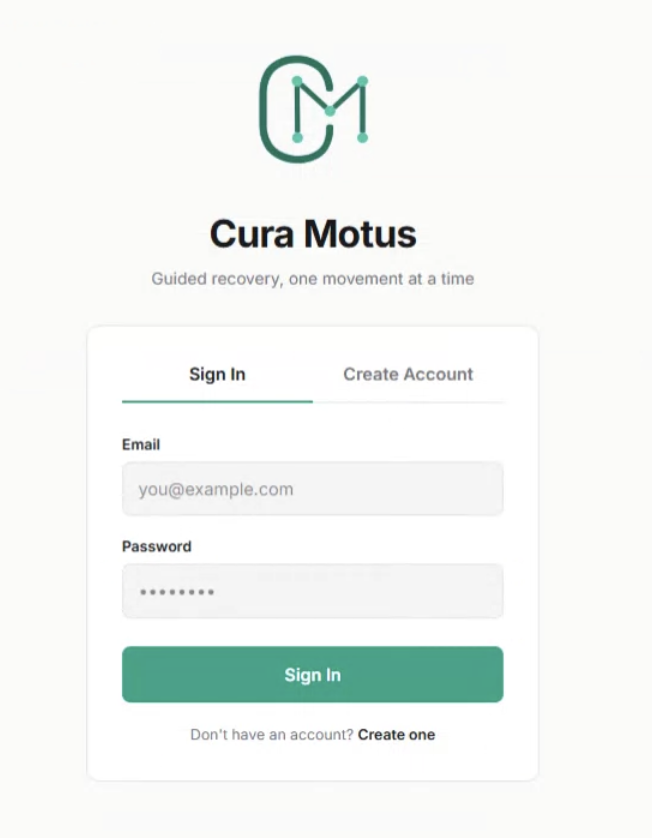
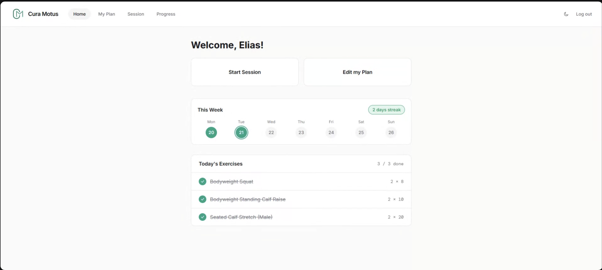
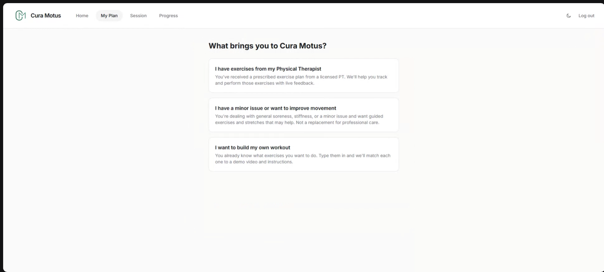
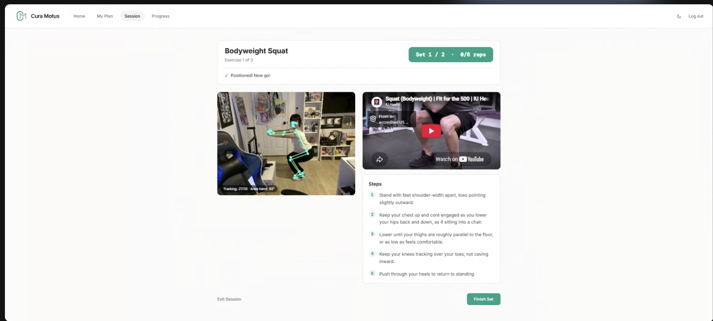
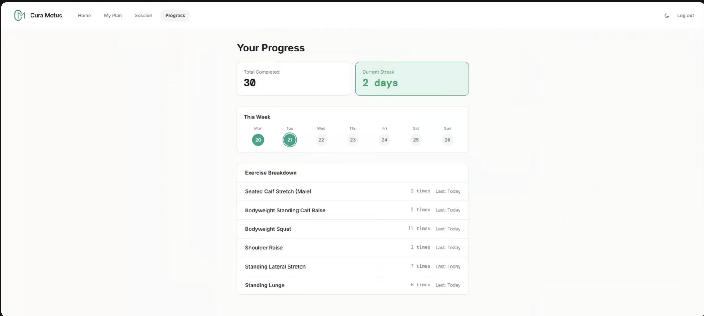

# Cura-Motus

 

Cura-Motus ("Care in Motion") is a web app that uses real-time, camera-based pose estimation to help at-home physical therapy patients stay consistent with their prescribed exercises. Physical therapy is expensive, and most patients who train unsupervised at home have no reliable way to stay motivated or track their effort. Cura-Motus counts each rep as it happens, calls out the count out loud, and keeps users motivated to finish their sets, while pointing them to a linked YouTube video tutorial for proper exercise form. It generates a personalized AI exercise plan from each user's onboarding inputs and is built as a supplement to professional care, not a replacement.

## Features

- Real-time, camera-based pose estimation that automatically counts exercise reps
- Spoken, out-loud rep counting and motivational cues to keep users going through a set
- Linked YouTube video tutorials for each exercise so users can follow along for proper form
- AI-generated, personalized exercise plans built from onboarding inputs (sport, injury, current issue)
- Progress tracking across sessions to monitor recovery over time
- Secure user account creation and login
- Five core PT exercises: shoulder raise, bodyweight squat, standing knee extension/leg raise, standing lunge, and arm circles / range-of-motion stretch

## How To Use

Try the live app: [cura-motus.vercel.app](https://cura-motus.vercel.app)

### Sign In / Create Account

New users create an account, and returning users sign in to pick up their plan and progress where they left off.

### Home

The home dashboard shows today's exercises, a weekly streak tracker, and quick links to start a session or edit your plan. Cura-Motus supports both light and dark mode.

### Build Your Plan

On first use, tell Cura-Motus what brings you in — a PT-prescribed plan, general soreness or stiffness, or a custom workout you want to build yourself — and it generates a personalized exercise plan around your input.

### Live Session

During a session, real-time pose estimation tracks your reps on camera alongside a linked YouTube tutorial and step-by-step form instructions, counting reps out loud as you go.

### Progress

Track completed sessions, your current streak, and a breakdown of reps per exercise over time.

## Technologies Used

- React
- Vite
- Tailwind CSS
- [Supabase](https://supabase.com) (database & authentication)
- [YouTube Data API v3](https://developers.google.com/youtube/v3) (linked exercise tutorials)
- [MediaPipe](https://ai.google.dev/edge/mediapipe) (real-time pose estimation & rep counting)
- Web Speech API (spoken rep counts & motivational feedback)
- Python 3
- Flask
- [OpenAI API](https://platform.openai.com/docs/api-reference) (personalized exercise plan generation)
- [Ascend API](https://ascendapi.com) (exercise library & demonstrations)

---

## Contact

For questions, suggestions, or collaborative opportunities, please contact:

### Eva King-Senior
- Email: [evakingsr@gmail.com](mailto:evakingsr@gmail.com)
- GitHub: [evakingsr](https://github.com/evakingsr)

### Malek Aloulou
- Email: [aloulou@bc.edu](mailto:aloulou@bc.edu)
- GitHub: [aloulou-dev](https://github.com/aloulou-dev)

### Shellsea Nunez-Aviles
- Email: [shenunavi126@gmail.com](mailto:shenunavi126@gmail.com)
- GitHub: [aesheeds](https://github.com/aesheeds)

### Ty Torres
- Email: [Tytorres55@gmail.com](mailto:Tytorres55@gmail.com)
- GitHub: [thy-dye](https://github.com/thy-dye)